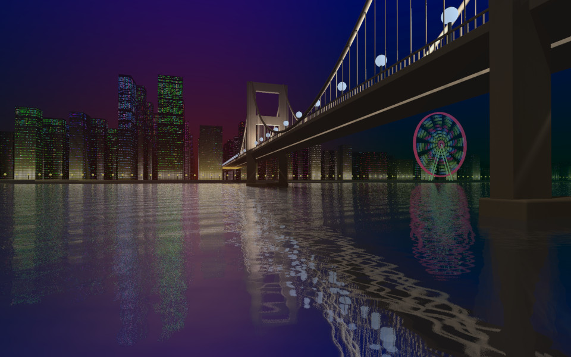

## Dusk City (Executable Graphics)

This was my entry for the 4k Executable graphics competition at the [Black Valley 2024](https://2024.blackvalley.party) demoparty, where it placed 2nd out of 4 entries. The competition requires that the executable is a maximum of 4096 bytes.

Black Valley is the annual Norwegian [demoscene](https://en.wikipedia.org/wiki/Demoscene) event.

The program simulates a long exposure photograph by combining multiple renders of a waterfront cityscape, where each image is rendered via an OpenGL shader technique called [ray marching](https://iquilezles.org/articles/raymarchingdf/). Fun fact: I reduced the number of renders from 16 to 8 after crashing the GPU on the demo PC.

